In this website app design, I used three design principles: Color theory: Triadic Color Schemes, Proportion and White Space. 

The main colors I used in this web app are purple, pink, yellow and orange, which inspired by the Triadic Color Schemes in the Color theory, these will make the page looks harmonious. Because it is a web app used for study, a simple page layout is important. Concise page layout is firstly easier for users to use, and secondly, it prevent them from getting distracted. Therefore, I leaved big areas of white space to help users focus on the important things.

I made things smaller overall because I found it more comfortable to look at in full screen.

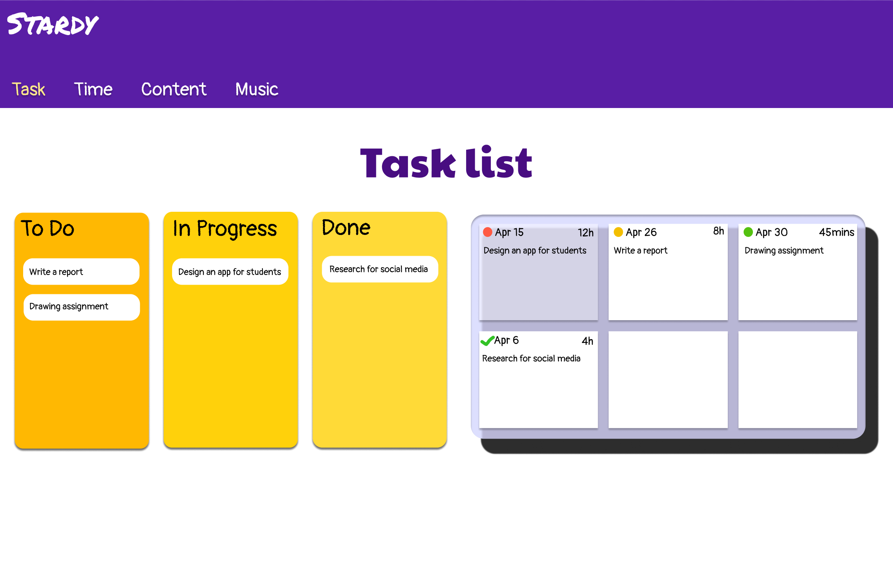

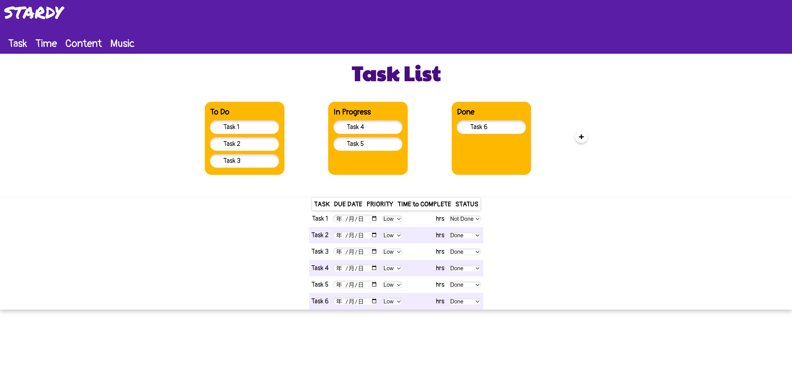

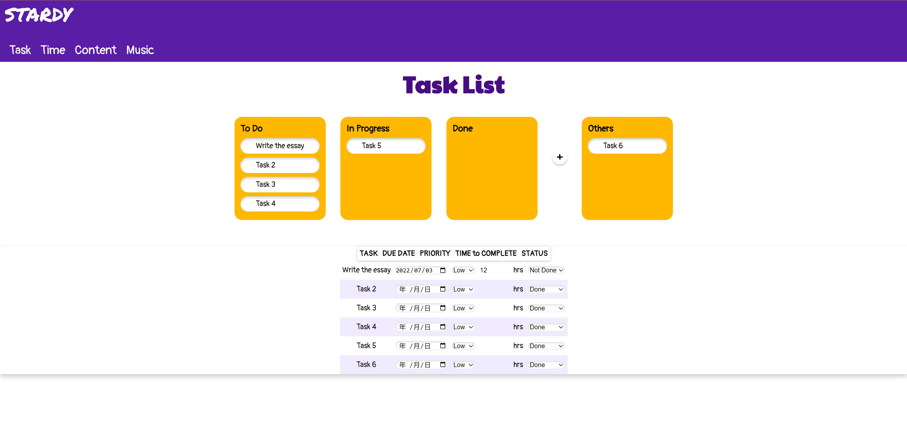

I made some changes to the layout because users may add more columns of kanban board, there will no more space to add columns if I put the kanban board on the left and the task list on the right. I changed the task list design because the table is more easier for users to edit and understand.

Users can edit the tasks and change the columns name and drag and drop the tasks betweem columns. They can also add columns by click the "+" button.

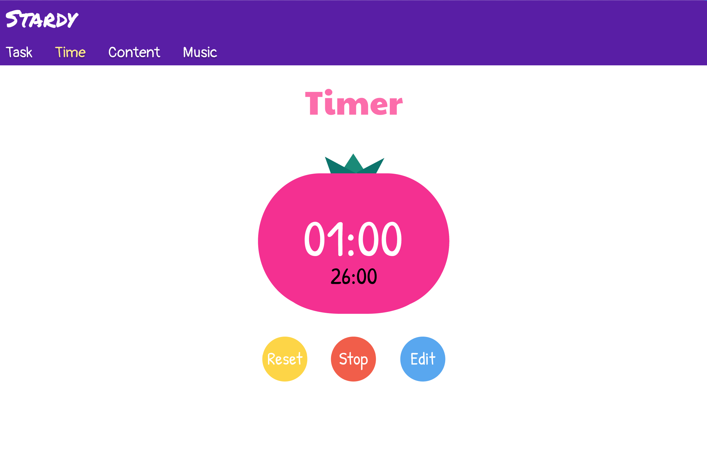

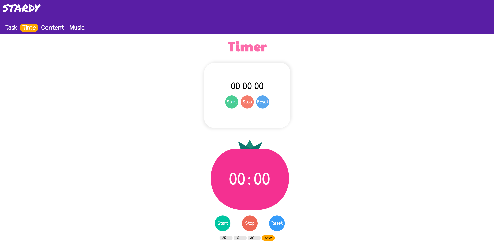

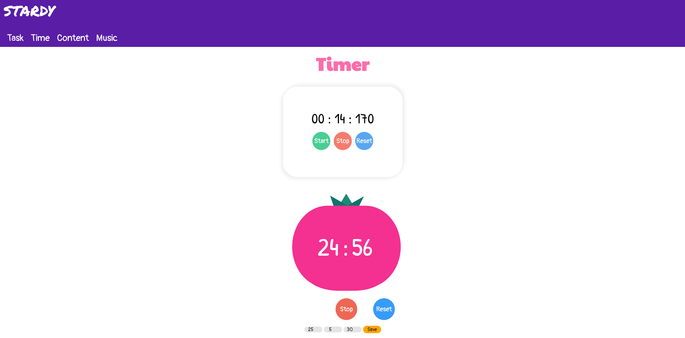

Compared to the original design, I separated the stopwatch and the Pomodoro timer to two parts. In this way, users can better understand how to user and will not unnecessarily start Pomodoros when they only want to use the stopwatch.

Buttons will change color when the mouse is over them, and the start button will disappear when the Pomodoro is started. Users can start, stop and reset these timers with buttons. Users can edit pomodoro session and break on the buttom of the page. 

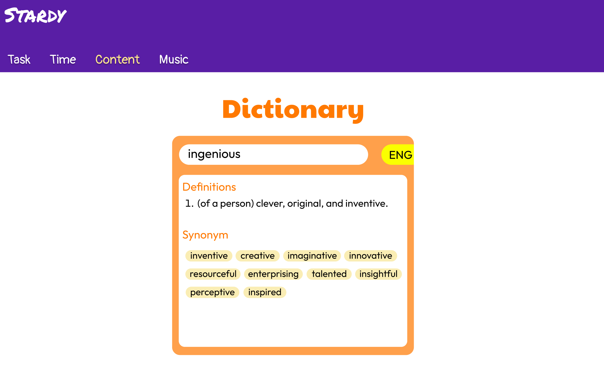

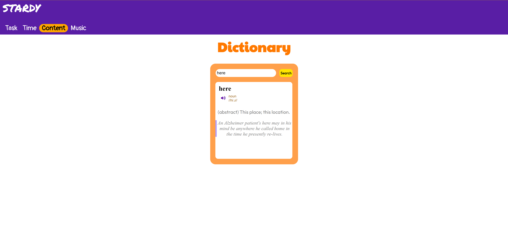

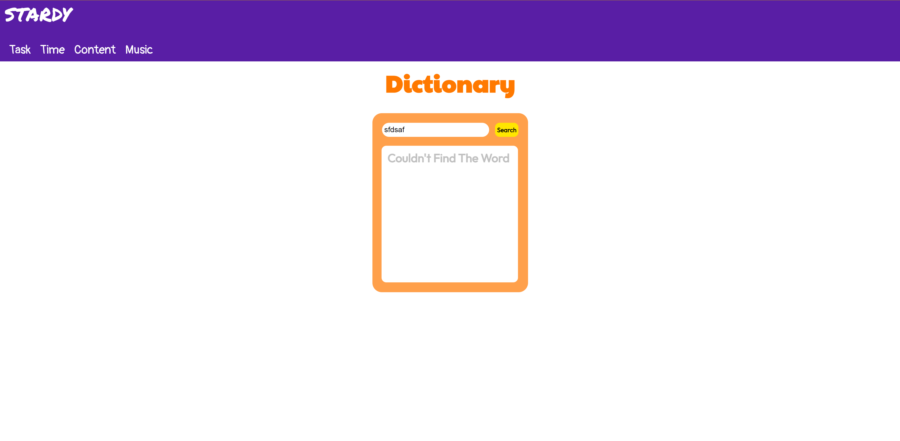

Compared to original design, users can see the pronunciation of the word, and if you search for a word that does not exist, the dictionary will show that the word cannot be found.

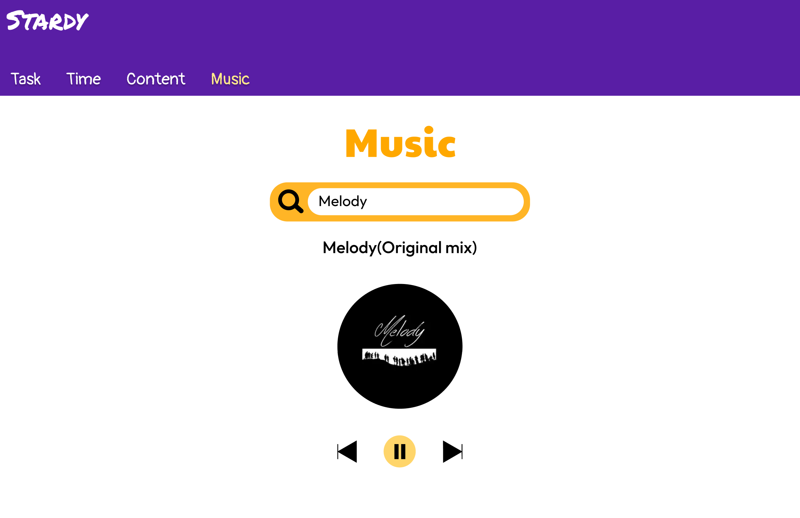

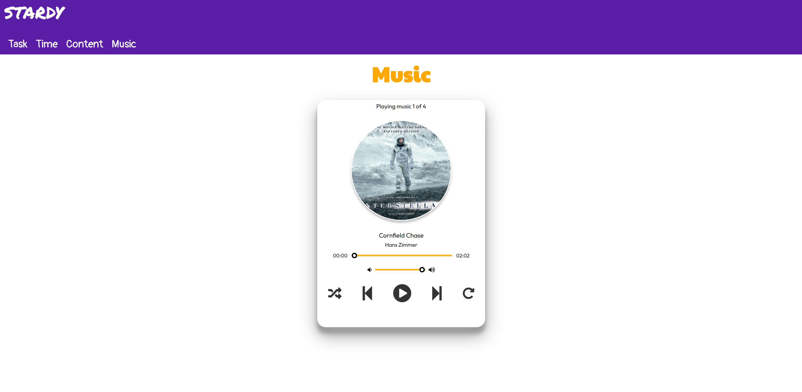

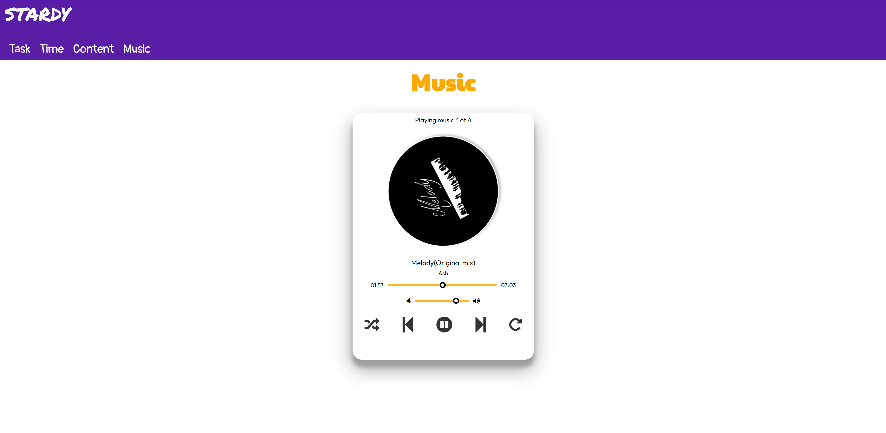

I added a shadow border to the music player and make the music pictures rotatable to make it look better.The new music player is to play local music, users can adjust the volume and song progress and set the loop type.

**References:**

https://blog.devgenius.io

abhik b.(2021, January) Pomodoro Timer with Circular Progress Indicator. Retrieved from
https://www.youtube.com/watch?v=MtYR2vCs2R0&t=399s

Coding Artist.(2021, September) Dictionary App.Retrieved from
https://www.youtube.com/watch?v=PUkgK7TI0x0

Lam.(2021, October) Build a Music Player with JavaScript. Retrieved from
https://www.youtube.com/watch?v=oscPp3KghS8&t=1162s